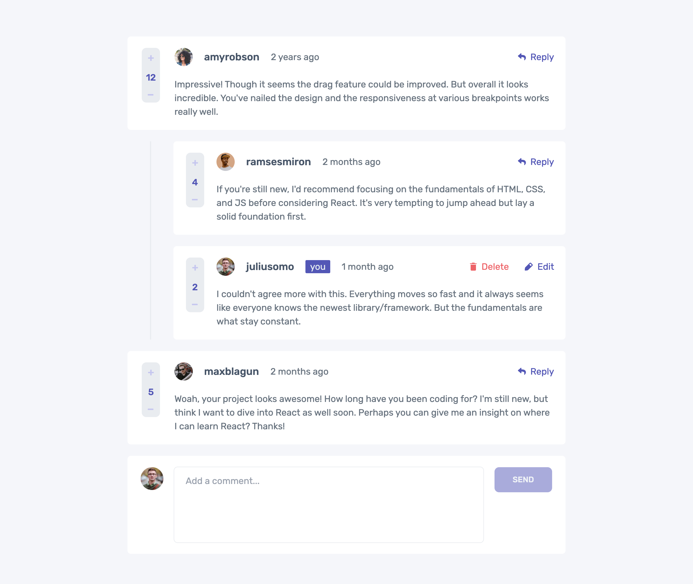

# Frontend Mentor - Interactive comments section solution

This is a solution to the [Interactive comments section challenge on Frontend Mentor](https://www.frontendmentor.io/challenges/interactive-comments-section-iG1RugEG9). Frontend Mentor challenges help you improve your coding skills by building realistic projects. 

## Table of contents

- [Overview](#overview)
  - [The challenge](#the-challenge)
  - [Screenshot](#screenshot)
  - [Links](#links)
- [My process](#my-process)
  - [Built with](#built-with)
  - [What I learned](#what-i-learned)
  - [Useful resources](#useful-resources)
- [Author](#author)

## Overview

### The challenge

Users should be able to:

- View the optimal layout for the app depending on their device's screen size
- See hover states for all interactive elements on the page
- Create, Read, Update, and Delete comments and replies
- Upvote and downvote comments
- **Bonus**: If you're building a purely front-end project, use `localStorage` to save the current state in the browser that persists when the browser is refreshed.
- **Bonus**: Instead of using the `createdAt` strings from the `data.json` file, try using timestamps and dynamically track the time since the comment or reply was posted.

### Screenshot

### Links

- Solution URL: [https://www.frontendmentor.io/solutions/angular-interactive-comments-LVgnKKcPH3](https://www.frontendmentor.io/solutions/angular-interactive-comments-LVgnKKcPH3)
- Live Site URL: [https://jacob-briscoe.github.io/interactive-comments/](https://jacob-briscoe.github.io/interactive-comments/)

## My process

I started building this app by creating a sandbox to experiment with the various components needed in the app. I used this as a way to create the styles so that I could
visually make adjustments to the look and feel. Once I was satisfied with the look and feel, I moved on to individual component behavior. Next, I focused on putting 
the components together in the main screen of the app. And finally, I created a component store to properly handle reactivity and state.

### Built with

- Semantic HTML5 markup
- CSS
- Flexbox
- CSS Grid
- Mobile-first workflow
- [Angular](https://angular.dev/) - Front-End Framework
- [TailwindCSS](https://tailwindcss.com/) - For styles

### What I learned

One of the most challenging aspects of this was to calculate relative time for the comments. Initially I considered pulling in a library to handle this for me
but I wanted the challenge of calculating it myself. In addition, I made the relative time calculation update automatically as well.

### Useful resources

- [Angular Dev](https://angular.dev/) - This is a great site for referencing Angular documentation.
- [MDN](https://mdn.io) - I referenced this site many times, great for HTML, CSS, and JavaScript.
- [TypeScript](https://www.typescriptlang.org/) - Typescript documentation.

## Author

- Website - [Jacob Briscoe](https://jacob-briscoe.github.io/)
- Frontend Mentor - [@jacob-briscoe](https://www.frontendmentor.io/profile/jacob-briscoe)
